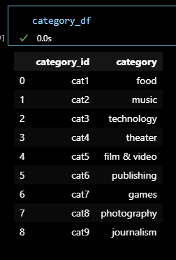
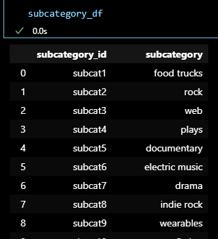
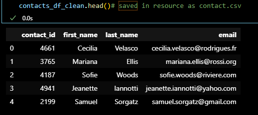
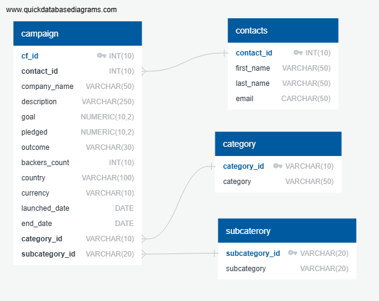
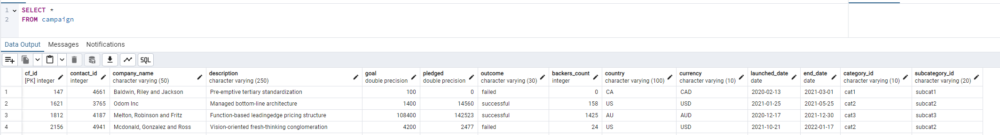
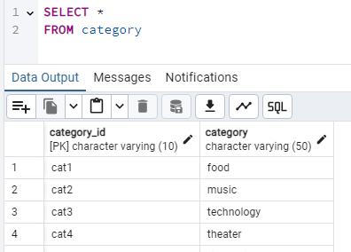
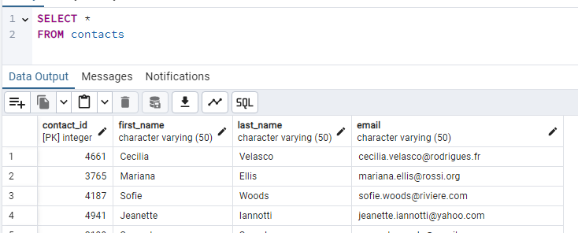
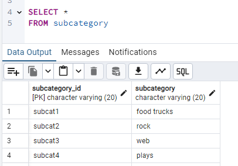

# Crowdfunding ETL
---
---

### This crowdfunding_ETL repository is a project executed by Miguel Soriano and Kelvin Osei Assibey.
---

This repository contains a resource folder, ERD.png, ETL_Mini_Project_KOseiassibey_MSoriano.ipynb(With regex option to create the contacts Daframe) and crowdfunding_db_schema.sql.

---

DataFrames Created

-
 

-

-

- From the panda creation file, still the same out put for the regex creation file

---

Resource folder contains the following exported files:

- campaign.csv
- category.csv
- contacts.csv
- subcategory.csv

-It also has:

    The xlsx files from the starter code.

    Readme_resouces folder

    Alternative folder with following files:

     * copy of ETL_Mini_Project_KOseiassibey_MSoriano (with both option the create contacts Daframe).
     * crowdfunding_db_schema.sql showing a different way of creating schema(just for informational use).
    

    

---

ERD.png depicting the schema for the database.

*

---

ETL_Mini_Project_KOseiassibey_MSoriano.ipynb is the jupyter notebook that contains the code to create the the DataFrames for the csv file in the resources folder.

-----
The primary Crowdfunding_db_schema.sql containing code to create the database and tables show in images below,as well as the query code to verify the tables and data. The imformational alternative schema in Alternative folder in Resources folder, Crowdfunding_db_schema.sql create with help of the [QuickDBD](quickdatabasediagrams.com), then small modification to properly function.

Folder Readme_resources in Resources contain screenshot of working schema with imported data.

* campaign table

* category table

* contacts table

* subcategory table

