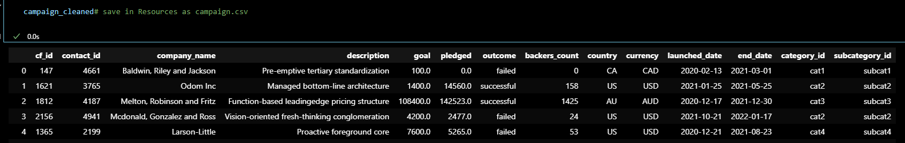

# Crowdfunding ETL
---
---

### This crowdfunding_ETL repository is a project executed by Miguel Soriano and Kelvin Osei Assibey.
---

This repository contains a resource folder, ERD.png, ETL_Mini_Project_KOseiassibey_MSoriano.ipynb(With regex option to create the contacts Daframe) and crowdfunding_db_schema.sql.

---

DataFrames Created

-
 

-

-

-

---

Resource folder contains the following exported files:

- campaign.csv
- category.csv
- contacts.csv
- subcategory.csv

-It also was:

    copy of ETL_Mini_Project_KOseiassibey_MSoriano (with both option th create contacts Daframe).
    Readme_resouces folder
    The xlsx files from the starter code

---

ERD.png depicting the schema for the database.

*

---

ETL_Mini_Project_KOseiassibey_MSoriano.ipynb is the jupyter notebook that contains the code to create the the DataFrames for the csv file in the resources folder.

-----
Crowdfunding_db_schema.sql containing code for the schema relationships for the database. Crowdfunding_db_schema.sql create with help of the [QuickDBD](quickdatabasediagrams.com), then small modification to properly function.

Folder Readme_resources in Resources contain screenshot of working schema with imported data.

* campaign table

* category table

* contacts table

* subcategory table

